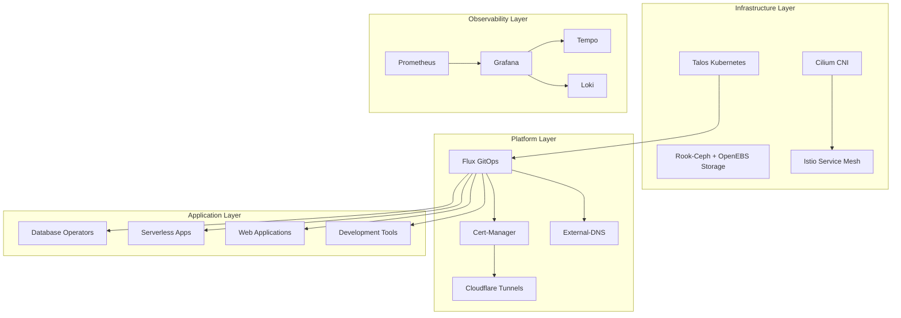

# HomeCluster Documentation

## Table of Contents

- [Overview](#overview)
- [Architecture](#architecture)
- [Quick Start](#quick-start)
- [Documentation Index](#documentation-index)
- [Key Features](#key-features)
- [Technology Stack](#technology-stack)
- [Getting Help](#getting-help)

## Overview

HomeCluster is a production-ready Kubernetes cluster designed for home lab environments, built using GitOps principles with Flux CD. This repository contains the complete infrastructure-as-code setup for deploying and managing a highly available Kubernetes cluster with modern cloud-native technologies.

The cluster runs on Talos (an immutable, minimal Kubernetes OS) provisioned on Proxmox VMs via OpenTofu, providing enterprise-grade features including:

- **GitOps-driven deployments** with Flux CD
- **Encrypted secrets management** using SOPS and Age
- **Service mesh capabilities** with Istio (ambient mode)
- **Advanced networking** with Cilium CNI
- **Distributed storage** with Rook-Ceph (block/object) and OpenEBS (local PV)
- **Comprehensive observability** with Grafana, Prometheus, Loki, and Tempo
- **Serverless workloads** with KNative
- **Multiple database operators** for PostgreSQL, Kafka, ArangoDB, DragonflyDB, and Elastic

## Architecture

The cluster follows a layered architecture approach:

## Quick Start

1. **Prerequisites**: Ensure you have the required tools installed (see [Deployment Guide](deployment-guide.md))
2. **Provision VMs**: Use OpenTofu to create Talos VMs on Proxmox
3. **Configure**: Update secrets and cluster settings
4. **Deploy**: Follow the [Deployment Guide](deployment-guide.md) for complete setup instructions

## Documentation Index

| Document | Description |
|----------|-------------|
| [Architecture](architecture.md) | Detailed system architecture and component relationships |
| [Kubernetes Infrastructure](kubernetes-infrastructure.md) | Infrastructure components and operators |
| [Kubernetes Applications](kubernetes-applications.md) | Application deployments and configurations |
| [Flux GitOps](flux-gitops.md) | GitOps workflow and Flux configuration |
| [Terraform Provisioning](terraform.md) | Infrastructure provisioning with OpenTofu/Terraform |
| [Deployment Guide](deployment-guide.md) | Complete deployment and configuration instructions |
| [Networking](networking.md) | Network configuration and service mesh setup |
| [Ceph NVMe Setup](ceph-nvme-setup.md) | NVMe drive setup and optimization guide |
| [Ceph OSD Replacement](ceph-osd-replacement-procedures.md) | OSD replacement procedures |
| [Ceph Disaster Recovery](ceph-disaster-recovery-procedures.md) | Disaster recovery scenarios |
| [Authentik + Istio Forward Auth](authentik-istio-forward-auth.md) | Authentik forward auth with Istio |

## Key Features

### GitOps Workflow
- **Flux CD** for continuous deployment
- **Git-based** configuration management
- **Automated** reconciliation and drift detection

### Security
- **SOPS encryption** for secrets at rest
- **Age encryption** for secure key management
- **Istio ambient mesh** for zero-trust networking
- **Cert-manager** for automated TLS certificates
- **Kyverno** for policy enforcement

### Comprehensive Observability
- **Prometheus** for metrics collection
- **Grafana** for visualization and dashboards
- **Tempo** for distributed tracing
- **Loki** for log aggregation

### Modern Platform
- **KNative** for serverless workloads
- **Multiple database operators** (PostgreSQL, Kafka, ArangoDB, DragonflyDB, Elastic)
- **Event-driven architecture** with Kafka (Strimzi) and Redpanda
- **Container registry** with Harbor
- **CI/CD pipelines** with Tekton

### Network and Ingress
- **Cilium CNI** with eBPF networking
- **Istio ambient mesh** for traffic management (no sidecars)
- **Cloudflare Tunnels** for secure external access
- **External-DNS** for automated DNS management
- **Tailscale** for private network connectivity

## Technology Stack

### Core Infrastructure
- **Kubernetes**: Talos distribution on Proxmox VMs
- **Provisioning**: OpenTofu (Terraform-compatible)
- **CNI**: Cilium for networking and security
- **Storage**: Rook-Ceph (block/object) + OpenEBS (local PV)
- **Service Mesh**: Istio ambient mode

### GitOps and Automation
- **Flux CD**: GitOps continuous delivery
- **SOPS**: Secrets encryption
- **Age**: Encryption key management
- **Renovate**: Automated dependency updates

### Observability
- **Prometheus**: Metrics and monitoring
- **Grafana**: Dashboards and visualization
- **Tempo**: Distributed tracing
- **Loki**: Log aggregation
- **InfluxDB**: Time-series data

### Data and Messaging
- **CloudNative-PG**: PostgreSQL operator
- **Strimzi**: Apache Kafka operator
- **Redpanda**: Kafka-compatible streaming
- **ArangoDB**: Multi-model database
- **DragonflyDB**: Redis-compatible datastore
- **Elastic**: Elasticsearch operator

### Development and Tools
- **Harbor**: Container registry
- **Authentik**: Identity provider
- **Tekton**: CI/CD pipelines
- **KNative**: Serverless platform
- **KubeVirt**: Virtual machine workloads

### Home Automation
- **Home Assistant**: Home automation platform
- **ESPHome**: IoT device management
- **Node-RED**: Flow-based automation
- **RabbitMQ**: Message broker

## Getting Help

- **Issues**: Create an issue in this repository for bugs or feature requests
- **Discussions**: Use GitHub Discussions for questions and community support
- **Community**: Join the [Home Operations](https://discord.gg/home-operations) Discord

## Contributing

This is a personal home lab setup, but contributions and suggestions are welcome! Please:

1. Fork the repository
2. Create a feature branch
3. Make your changes
4. Submit a pull request

## License

This project is licensed under the MIT License - see the [LICENSE](../LICENSE) file for details.
