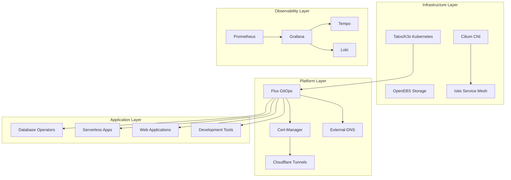

# HomeCluster Documentation

## Table of Contents

- [Overview](#overview)
- [Architecture](#architecture)
- [Quick Start](#quick-start)
- [Documentation Index](#documentation-index)
- [Key Features](#key-features)
- [Technology Stack](#technology-stack)
- [Getting Help](#getting-help)

## Overview

HomeCluster is a production-ready Kubernetes cluster designed for home lab environments, built using GitOps principles with Flux CD. This repository contains the complete infrastructure-as-code setup for deploying and managing a highly available Kubernetes cluster with modern cloud-native technologies.

The cluster is designed to run on bare metal or virtual machines within a home network, providing enterprise-grade features including:

- **GitOps-driven deployments** with Flux CD
- **Encrypted secrets management** using SOPS and Age
- **Service mesh capabilities** with Istio
- **Advanced networking** with Cilium CNI
- **Comprehensive observability** with Grafana, Prometheus, and Tempo
- **Serverless workloads** with KNative
- **Multiple database operators** for PostgreSQL, MongoDB, Redis, and more

## Architecture

The cluster follows a layered architecture approach:

## Quick Start

1. **Prerequisites**: Ensure you have the required tools installed (see [Deployment Guide](deployment-guide.md))
2. **Initialize**: Run `task init` to create configuration files
3. **Configure**: Update `config.yaml` with your environment settings
4. **Deploy**: Follow the [Deployment Guide](deployment-guide.md) for complete setup instructions

## Documentation Index

| Document | Description |
|----------|-------------|
| [Architecture](architecture.md) | Detailed system architecture and component relationships |
| [Kubernetes Infrastructure](kubernetes-infrastructure.md) | Infrastructure components and operators |
| [Kubernetes Applications](kubernetes-applications.md) | Application deployments and configurations |
| [Flux GitOps](flux-gitops.md) | GitOps workflow and Flux configuration |
| [Terraform Provisioning](terraform.md) | Infrastructure provisioning with Terraform |
| [Deployment Guide](deployment-guide.md) | Complete deployment and configuration instructions |
| [Networking](networking.md) | Network configuration and service mesh setup |
| [Security](security.md) | Security policies and secret management |
| [Monitoring](monitoring.md) | Observability and monitoring setup |
| [Troubleshooting](troubleshooting.md) | Common issues and debugging guides |

## Key Features

### 🔄 GitOps Workflow
- **Flux CD** for continuous deployment
- **Git-based** configuration management
- **Automated** reconciliation and drift detection

### 🔐 Security First
- **SOPS encryption** for secrets at rest
- **Age encryption** for secure key management
- **Istio service mesh** for zero-trust networking
- **Cert-manager** for automated TLS certificates

### 📊 Comprehensive Observability
- **Prometheus** for metrics collection
- **Grafana** for visualization and dashboards
- **Tempo** for distributed tracing
- **Loki** for log aggregation

### 🚀 Modern Platform
- **KNative** for serverless workloads
- **Multiple database operators** (PostgreSQL, ArangoDB, Redis, etc.)
- **Event-driven architecture** with Kafka and Strimzi
- **Container registry** with Harbor

### 🌐 Network & Ingress
- **Cilium CNI** with eBPF networking
- **Istio service mesh** for advanced traffic management
- **Cloudflare Tunnels** for secure external access
- **External-DNS** for automated DNS management

## Technology Stack

### Core Infrastructure
- **Kubernetes**: Talos/K3s distribution
- **CNI**: Cilium for networking and security
- **Storage**: OpenEBS for persistent volumes
- **Service Mesh**: Istio for traffic management

### GitOps & Automation
- **Flux CD**: GitOps continuous delivery
- **SOPS**: Secrets encryption
- **Age**: Encryption key management
- **Renovate**: Automated dependency updates

### Observability
- **Prometheus**: Metrics and monitoring
- **Grafana**: Dashboards and visualization
- **Tempo**: Distributed tracing
- **Loki**: Log aggregation

### Data & Messaging
- **CloudNative-PG**: PostgreSQL operator
- **Strimzi**: Apache Kafka operator
- **ArangoDB**: Multi-model database
- **DragonflyDB**: Redis-compatible datastore

### Development & Tools
- **Harbor**: Container registry
- **Authentik**: Identity provider
- **Tekton**: CI/CD pipelines
- **KNative**: Serverless platform

## Getting Help

- **Issues**: Create an issue in this repository for bugs or feature requests
- **Discussions**: Use GitHub Discussions for questions and community support
- **Documentation**: Check the [troubleshooting guide](troubleshooting.md) for common issues

## Contributing

This is a personal home lab setup, but contributions and suggestions are welcome! Please:

1. Fork the repository
2. Create a feature branch
3. Make your changes
4. Submit a pull request

## License

This project is licensed under the MIT License - see the [LICENSE](../LICENSE) file for details.