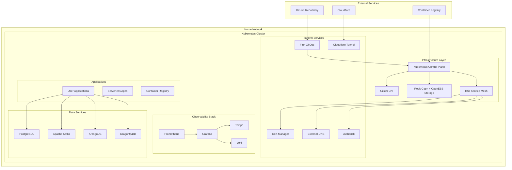
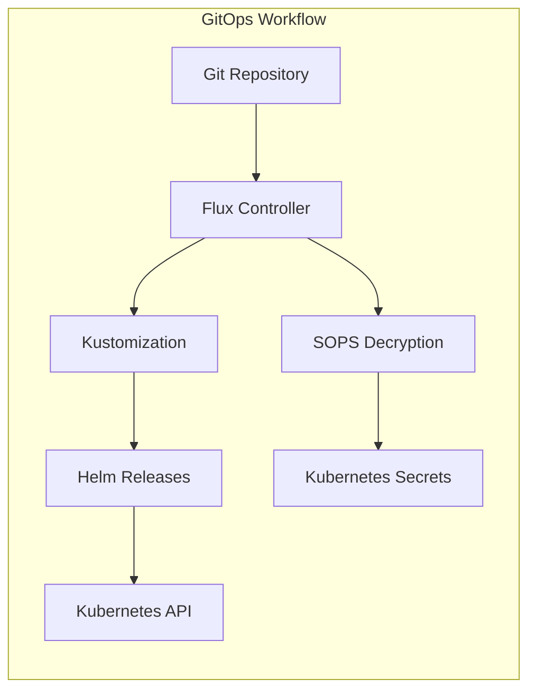
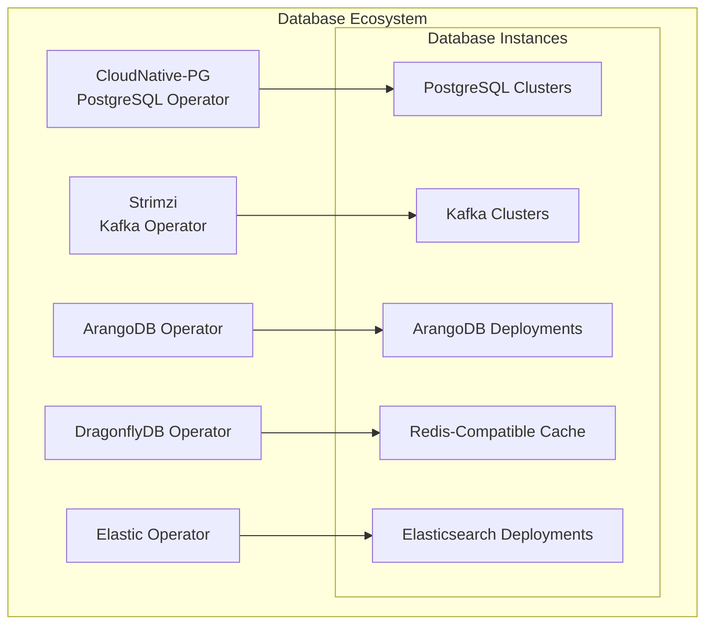
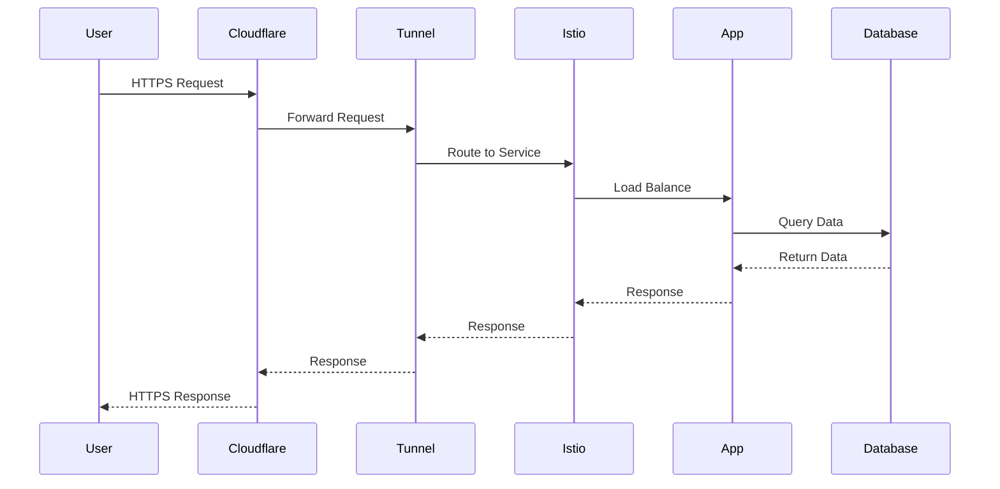
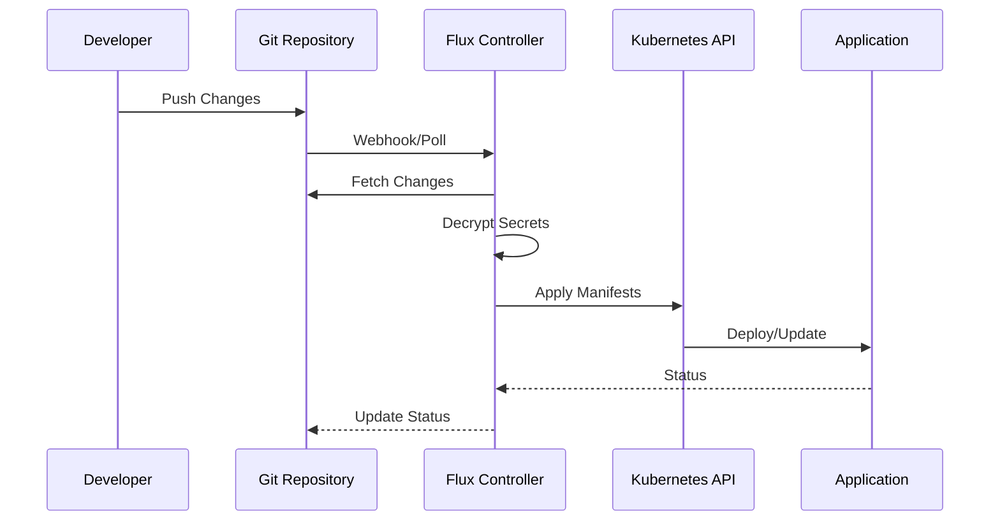
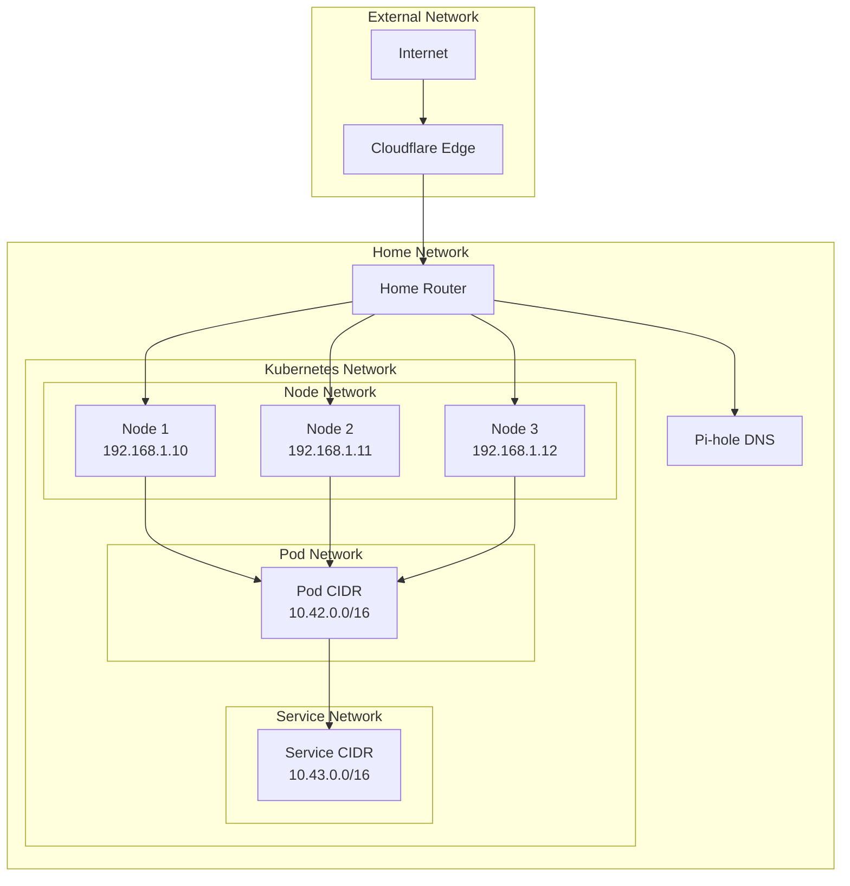
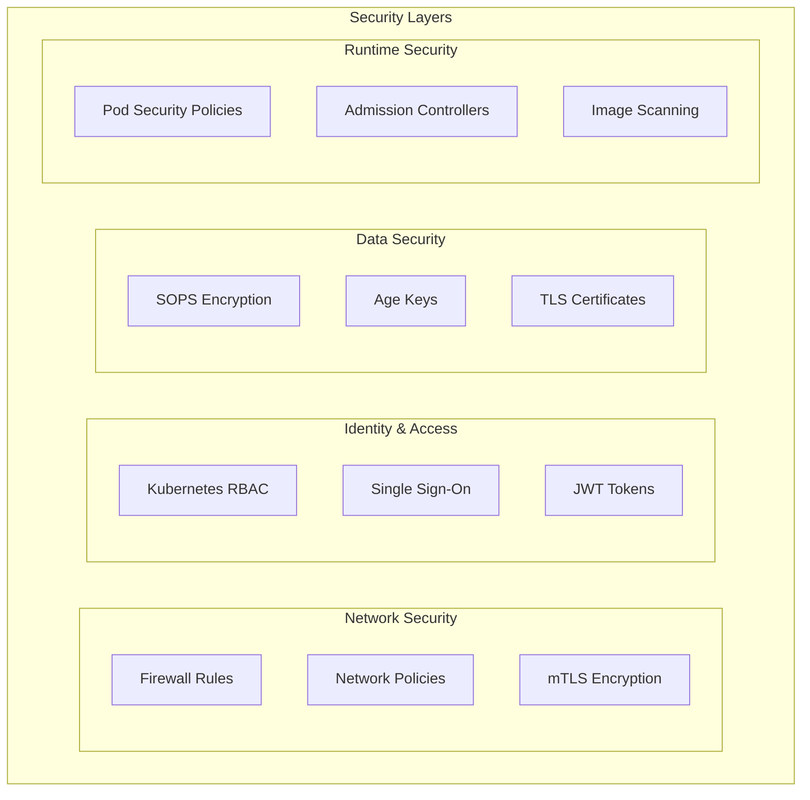

# System Architecture

## Table of Contents

- [Overview](#overview)
- [High-Level Architecture](#high-level-architecture)
- [Infrastructure Layer](#infrastructure-layer)
- [Platform Layer](#platform-layer)
- [Application Layer](#application-layer)
- [Data Flow](#data-flow)
- [Network Architecture](#network-architecture)
- [Security Architecture](#security-architecture)
- [Deployment Pipeline](#deployment-pipeline)

## Overview

The HomeCluster architecture is designed as a multi-layered system that provides enterprise-grade capabilities for home lab environments. The architecture follows cloud-native principles with GitOps-driven deployments, service mesh networking, and comprehensive observability.

This repository implements a **home‑lab Kubernetes cluster** using the following core components:

- **Talos** as the operating system for the nodes (running on Proxmox VMs)
- **Kubernetes** (Talos‑managed) with **Flux** for GitOps‑driven configuration
- **Cilium** for networking and security policies
- **Istio** as the service mesh (ambient mode -- no sidecars)
- **External‑DNS** with Cloudflare for DNS management
- **Cloudflare Tunnels** for external ingress
- **KNative** for server‑less workloads
- **Rook‑Ceph** for distributed block/object storage and **OpenEBS** for local persistent volumes
- **Observability stack**: Grafana, Prometheus (kube‑prometheus‑stack), Loki, Tempo

The repository follows a **GitOps** model: all changes are made via Git, and Flux reconciles the state to the cluster. Secrets are encrypted with **SOPS** and **Age**.

## High-Level Architecture

## Infrastructure Layer

### Kubernetes Distribution
- **Talos**: Immutable, minimal operating system purpose-built for Kubernetes
- **High Availability**: Multi-master setup with etcd clustering
- **Provisioning**: OpenTofu (Terraform-compatible) on Proxmox VMs

### Container Network Interface (CNI)
- **Cilium**: eBPF-based networking and security
- **Features**:
  - Network policies and security
  - Load balancing and service mesh
  - Observability and monitoring
  - Cluster mesh capabilities

### Storage
- **Rook-Ceph**: Distributed storage providing block (RBD) and object storage
  - NVMe-optimized OSDs
  - CephFS for shared filesystems
  - Object store for S3-compatible access
- **OpenEBS**: Container-attached storage for local persistent volumes
- **Storage Classes**:
  - Ceph RBD for replicated block storage
  - Local PV for high-performance workloads
  - Dynamic provisioning

### Service Mesh
- **Istio (Ambient Mode)**: Advanced traffic management and security without sidecar proxies
- **Components**:
  - Ztunnel for Layer 4 traffic handling
  - Istiod for configuration and certificate management
  - Istio CNI for pod network setup
  - Kiali for service mesh observability

## Platform Layer

### GitOps Engine

### Certificate Management
- **Cert-Manager**: Automated TLS certificate provisioning
- **Let's Encrypt**: Free SSL certificates
- **Cloudflare DNS Challenge**: Wildcard certificate support

### DNS Management
- **External-DNS**: Automated DNS record management
- **Cloudflare Integration**: Dynamic DNS updates
- **Split DNS**: Internal and external resolution

### Identity and Access
- **Authentik**: Identity provider and SSO
- **OAuth2/OIDC**: Modern authentication protocols
- **RBAC Integration**: Kubernetes role-based access control

## Application Layer

### Database Operators

### Serverless Platform
- **KNative Serving**: Serverless container platform
- **KNative Eventing**: Event-driven architecture
- **Auto-scaling**: Scale-to-zero capabilities
- **Traffic Management**: Blue-green and canary deployments

### Development Tools
- **Harbor**: Enterprise container registry
- **Tekton**: Cloud-native CI/CD pipelines
- **Telepresence**: Local development against remote cluster

## Data Flow

### Request Flow

### GitOps Deployment Flow

## Network Architecture

### Network Topology

### Service Mesh Traffic Management
- **Ingress Gateway**: Entry point for external traffic
- **Virtual Services**: Traffic routing rules
- **Destination Rules**: Load balancing and circuit breaking
- **Service Entries**: External service integration

## Security Architecture

### Security Layers

### Secret Management
- **SOPS**: Secrets encryption at rest
- **Age**: Modern encryption tool
- **Kubernetes Secrets**: Runtime secret injection
- **External Secrets**: Integration with external secret stores

## Deployment Pipeline

### CI/CD Architecture

```mermaid
graph LR
    subgraph "Development"
        DEV[Developer]
        IDE[IDE/Editor]
    end

    subgraph "Source Control"
        GIT[Git Repository]
        PR[Pull Request]
    end

    subgraph "CI Pipeline"
        VALIDATE[Validate YAML]
        LINT[Lint Code]
        TEST[Run Tests]
        BUILD[Build Images]
    end

    subgraph "CD Pipeline"
        FLUX[Flux Sync]
        DEPLOY[Deploy to Cluster]
        MONITOR[Monitor Health]
    end

    DEV --> IDE
    IDE --> GIT
    GIT --> PR
    PR --> VALIDATE
    VALIDATE --> LINT
    LINT --> TEST
    TEST --> BUILD
    BUILD --> FLUX
    FLUX --> DEPLOY
    DEPLOY --> MONITOR
```

### Deployment Stages
1. **Infrastructure**: Core Kubernetes components and operators
2. **Core**: Essential platform services (Flux, cert-manager, etc.)
3. **Applications**: User applications and workloads

### Health Checks and Monitoring
- **Readiness Probes**: Application startup validation
- **Liveness Probes**: Runtime health monitoring
- **Prometheus Metrics**: Performance and health metrics
- **Grafana Dashboards**: Visual monitoring and alerting

## Scalability Considerations

### Horizontal Scaling
- **Pod Autoscaling**: HPA based on CPU/memory metrics
- **Cluster Autoscaling**: Node scaling based on resource demands
- **Service Mesh**: Distributed load balancing

### Vertical Scaling
- **Resource Requests/Limits**: Proper resource allocation
- **Quality of Service**: Guaranteed, Burstable, and BestEffort classes
- **Storage Scaling**: Dynamic volume expansion

### Performance Optimization
- **Resource Quotas**: Namespace-level resource management
- **Affinity Rules**: Pod placement optimization
- **Caching Strategies**: Redis/DragonflyDB for application caching
