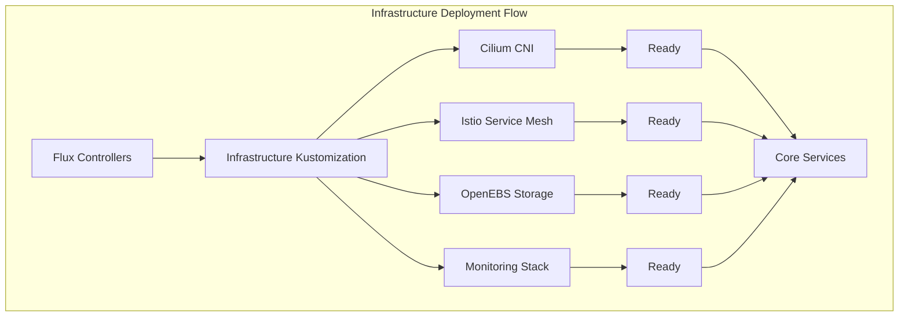

# Deployment Guide

## Table of Contents

- [Overview](#overview)
- [Prerequisites](#prerequisites)
- [Initial Setup](#initial-setup)
- [Infrastructure Deployment](#infrastructure-deployment)
- [Application Deployment](#application-deployment)
- [Post-Deployment Configuration](#post-deployment-configuration)
- [Verification and Testing](#verification-and-testing)
- [Troubleshooting](#troubleshooting)

## Overview

This guide provides step-by-step instructions for deploying the HomeCluster from scratch. The deployment follows a layered approach, starting with infrastructure components and progressing through platform services to applications.

**Deployment Phases**:
1. **Prerequisites**: Tool installation and environment setup
2. **Initial Setup**: Repository configuration and secrets
3. **Infrastructure**: Core Kubernetes components
4. **Platform Services**: GitOps, monitoring, and security
5. **Applications**: User-facing services and workloads

## Prerequisites

### Hardware Requirements

| Component | Minimum | Recommended |
|-----------|---------|-------------|
| **Nodes** | 3 nodes | 5+ nodes |
| **CPU** | 4 cores per node | 8+ cores per node |
| **Memory** | 8GB per node | 16GB+ per node |
| **Storage** | 120GB SSD per node | 500GB+ NVMe per node |
| **Network** | 1Gbps | 10Gbps |

### Software Requirements

#### Local Workstation Tools
```bash
# Package managers
brew install go-task          # Task runner
brew install direnv           # Environment management
brew install age              # Encryption tool
brew install sops             # Secret management
brew install flux             # GitOps CLI
brew install kubectl          # Kubernetes CLI
brew install helm             # Helm package manager
brew install cloudflared      # Cloudflare tunnel

# Optional tools
brew install k9s              # Kubernetes TUI
brew install stern            # Multi-pod log tailing
brew install kubectx          # Context switching
```

#### Cluster Requirements
- **Kubernetes**: v1.28+ (Talos/K3s)
- **Container Runtime**: containerd
- **CNI**: Cilium (installed via Flux)
- **Storage**: OpenEBS or equivalent CSI driver

### External Services

#### Required Services
- **GitHub Account**: Repository hosting and CI/CD
- **Cloudflare Account**: DNS management and tunnels
- **Domain Name**: Registered domain managed by Cloudflare

#### Optional Services
- **Container Registry**: Harbor (deployed in cluster) or external
- **Backup Storage**: S3-compatible storage for backups
- **Monitoring**: External monitoring endpoints (optional)

## Initial Setup

### 1. Repository Setup

#### Fork or Clone Repository
```bash
# Clone the repository
git clone https://github.com/your-username/HomeCluster.git
cd HomeCluster

# Enable direnv
direnv allow
```

#### Install Dependencies
```bash
# Install Python dependencies
task deps

# Install additional tools
task brew:deps
```

### 2. Configuration

#### Initialize Configuration Files
```bash
# Generate configuration templates
task init
```

This creates:
- `config.yaml`: Main configuration file
- Bootstrap variables and templates

#### Configure Environment Variables
Edit `config.yaml` with your environment-specific settings:

```yaml
# Example configuration
cluster:
  name: "homelab"
  domain: "example.com"
  
network:
  pod_cidr: "10.42.0.0/16"
  service_cidr: "10.43.0.0/16"
  
cloudflare:
  domain: "example.com"
  tunnel_id: "your-tunnel-id"
  api_token: "your-api-token"
```

### 3. Secret Management

#### Generate Age Key
```bash
# Generate encryption key
age-keygen -o age.key

# Set environment variable
export SOPS_AGE_KEY_FILE="$(pwd)/age.key"
```

#### Configure SOPS
Update `.sops.yaml` with your Age public key:

```yaml
creation_rules:
  - path_regex: kubernetes/.*\.sops\.ya?ml
    encrypted_regex: ^(data|stringData)$
    key_groups:
      - age: [your-age-public-key]
```

#### Create Cloudflare Tunnel
```bash
# Authenticate with Cloudflare
cloudflared tunnel login

# Create tunnel
cloudflared tunnel create homelab

# Note the tunnel ID and credentials for configuration
```

### 4. Template Generation

#### Generate Kubernetes Manifests
```bash
# Generate all manifests from templates
task configure
```

This process:
- Renders Jinja2 templates with configuration variables
- Encrypts secrets with SOPS
- Validates Kubernetes manifests
- Prepares the repository for GitOps deployment

## Infrastructure Deployment

### 1. Kubernetes Cluster Setup

#### Talos/K3s Installation
Follow the main README.md instructions for:
- Node preparation
- Kubernetes installation
- Initial cluster validation

#### Verify Cluster Access
```bash
# Check cluster connectivity
kubectl get nodes

# Verify cluster info
kubectl cluster-info
```

### 2. Flux Installation

#### Bootstrap Flux
```bash
# Install Flux in the cluster
task cluster:install
```

This command:
- Installs Flux controllers
- Creates the GitRepository source
- Applies the root Kustomization
- Starts the GitOps reconciliation process

#### Verify Flux Installation
```bash
# Check Flux components
flux get all

# Verify controllers are running
kubectl get pods -n flux-system
```

### 3. Infrastructure Layer Deployment

The infrastructure layer deploys automatically via Flux:



#### Monitor Infrastructure Deployment
```bash
# Watch infrastructure deployment
kubectl get pods -n kube-system -w
kubectl get pods -n istio-system -w
kubectl get pods -n monitoring -w

# Check Flux status
flux get kustomizations
```

## Application Deployment

### 1. Core Services

Core services deploy after infrastructure is ready:

#### Authentik (Identity Provider)
```bash
# Monitor Authentik deployment
kubectl get pods -n authentik -w

# Check service status
kubectl get svc -n authentik
```

#### Harbor (Container Registry)
```bash
# Monitor Harbor deployment
kubectl get pods -n harbor -w

# Verify Harbor is accessible
kubectl get virtualservice -n harbor
```

### 2. Database Operators

#### PostgreSQL Operator (CloudNative-PG)
```bash
# Check operator deployment
kubectl get pods -n cnpg-system

# Verify CRDs are installed
kubectl get crd | grep postgresql
```

#### Kafka Operator (Strimzi)
```bash
# Check Strimzi operator
kubectl get pods -n kafka

# Verify Kafka CRDs
kubectl get crd | grep kafka
```

### 3. Application Workloads

Applications deploy in the final phase:

#### Database Clusters
```bash
# Check PostgreSQL clusters
kubectl get postgresql -A

# Monitor cluster status
kubectl get pods -n postgres
```

#### Web Applications
```bash
# Check application deployments
kubectl get pods -n default

# Verify services are accessible
kubectl get virtualservice -A
```

## Post-Deployment Configuration

### 1. DNS Configuration

#### External DNS
Verify external-dns is creating DNS records:

```bash
# Check external-dns logs
kubectl logs -n networking deployment/external-dns

# Verify DNS records in Cloudflare dashboard
```

#### Internal DNS
Configure split DNS for internal resolution:

```bash
# Pi-hole configuration example
# /etc/dnsmasq.d/99-k8s-gateway-forward.conf
server=/your-domain.com/192.168.1.100
```

### 2. Certificate Management

#### Let's Encrypt Certificates
```bash
# Check cert-manager status
kubectl get pods -n cert-manager

# Verify certificate issuance
kubectl get certificates -A
kubectl get certificaterequests -A
```

#### Switch to Production Certificates
After verifying staging certificates work:

1. Update `config.yaml`:
   ```yaml
   certificates:
     production: true
   ```

2. Regenerate configuration:
   ```bash
   task configure
   ```

3. Commit and push changes for Flux to apply

### 3. Authentication Setup

#### Authentik Configuration
1. Access Authentik web interface
2. Complete initial setup wizard
3. Configure OAuth applications
4. Set up user groups and permissions

#### Application Integration
Configure applications to use Authentik for authentication:
- Grafana OAuth integration
- Harbor SSO setup
- Custom application authentication

### 4. Monitoring Configuration

#### Grafana Setup
1. Access Grafana dashboard
2. Configure data sources (Prometheus, Loki, Tempo)
3. Import dashboards
4. Set up alerting rules

#### Prometheus Configuration
```bash
# Verify Prometheus targets
kubectl port-forward -n monitoring svc/prometheus 9090:9090
# Open http://localhost:9090/targets
```

## Verification and Testing

### 1. Infrastructure Health Checks

#### Cluster Components
```bash
# Check all system pods
kubectl get pods --all-namespaces | grep -v Running

# Verify node status
kubectl get nodes -o wide

# Check cluster resources
task cluster:resources
```

#### Network Connectivity
```bash
# Test Cilium connectivity
cilium connectivity test

# Verify Istio configuration
istioctl analyze

# Check service mesh status
istioctl proxy-status
```

### 2. Application Testing

#### Database Connectivity
```bash
# Test PostgreSQL connection
kubectl exec -it -n postgres postgresql-cluster-1 -- psql -U postgres

# Test Kafka connectivity
kubectl exec -it -n kafka kafka-cluster-kafka-0 -- kafka-topics.sh --list --bootstrap-server localhost:9092
```

#### Web Application Access
```bash
# Test external access via Cloudflare tunnels
curl -I https://grafana.your-domain.com

# Test internal service resolution
kubectl run test-pod --image=busybox --rm -it -- nslookup grafana.monitoring.svc.cluster.local
```

### 3. Security Validation

#### Network Policies
```bash
# Verify network policies are applied
kubectl get networkpolicies -A

# Test policy enforcement
kubectl run test-pod --image=busybox --rm -it -- wget -O- http://restricted-service
```

#### Secret Encryption
```bash
# Verify secrets are encrypted in Git
grep -r "kind: Secret" kubernetes/ | head -5

# Check SOPS encryption
sops -d kubernetes/flux/vars/cluster-secrets.sops.yaml
```

## Troubleshooting

### Common Issues

#### 1. Flux Reconciliation Failures
```bash
# Check Flux status
flux get all

# View controller logs
kubectl logs -n flux-system deployment/source-controller
kubectl logs -n flux-system deployment/kustomize-controller

# Force reconciliation
flux reconcile source git flux-system
flux reconcile kustomization cluster
```

#### 2. Certificate Issues
```bash
# Check cert-manager logs
kubectl logs -n cert-manager deployment/cert-manager

# Verify certificate status
kubectl describe certificate -A

# Check ACME challenges
kubectl get challenges -A
```

#### 3. Network Connectivity Problems
```bash
# Check Cilium status
cilium status

# Verify Istio configuration
istioctl proxy-config cluster <pod-name>

# Test DNS resolution
kubectl run test-dns --image=busybox --rm -it -- nslookup kubernetes.default
```

#### 4. Storage Issues
```bash
# Check OpenEBS status
kubectl get pods -n openebs

# Verify storage classes
kubectl get storageclass

# Check PVC status
kubectl get pvc -A
```

### Recovery Procedures

#### Flux Recovery
If Flux stops working:

1. **Check Git connectivity**:
   ```bash
   flux get sources git
   ```

2. **Reinstall Flux**:
   ```bash
   flux uninstall
   task cluster:install
   ```

3. **Force full reconciliation**:
   ```bash
   flux reconcile source git flux-system --with-source
   ```

#### Application Recovery
For failed application deployments:

1. **Check resource status**:
   ```bash
   kubectl get all -n <namespace>
   kubectl describe pod <pod-name> -n <namespace>
   ```

2. **Review logs**:
   ```bash
   kubectl logs <pod-name> -n <namespace>
   stern -n <namespace> <app-name>
   ```

3. **Restart deployment**:
   ```bash
   kubectl rollout restart deployment/<deployment-name> -n <namespace>
   ```

### Performance Optimization

#### Resource Tuning
```bash
# Check resource usage
kubectl top nodes
kubectl top pods -A

# Adjust resource requests/limits in manifests
# Commit changes for Flux to apply
```

#### Storage Optimization
```bash
# Check storage usage
kubectl get pv
df -h /var/lib/rancher/k3s/storage

# Clean up unused volumes
kubectl delete pv <unused-pv>
```

### Monitoring and Alerting

#### Set Up Alerts
1. Configure Prometheus alert rules
2. Set up Grafana notifications
3. Test alert delivery

#### Performance Monitoring
1. Monitor cluster resource usage
2. Set up application-specific dashboards
3. Configure log aggregation

This deployment guide provides a comprehensive approach to setting up the HomeCluster. Follow each section carefully and verify each step before proceeding to ensure a successful deployment.