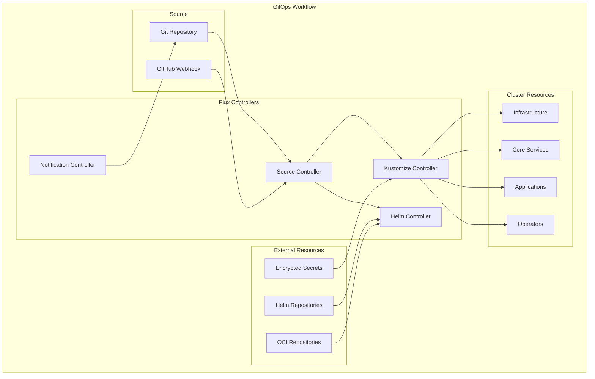
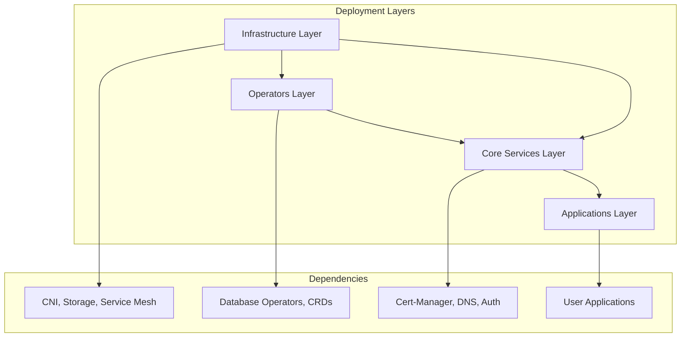
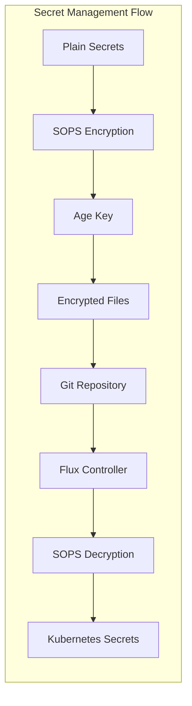
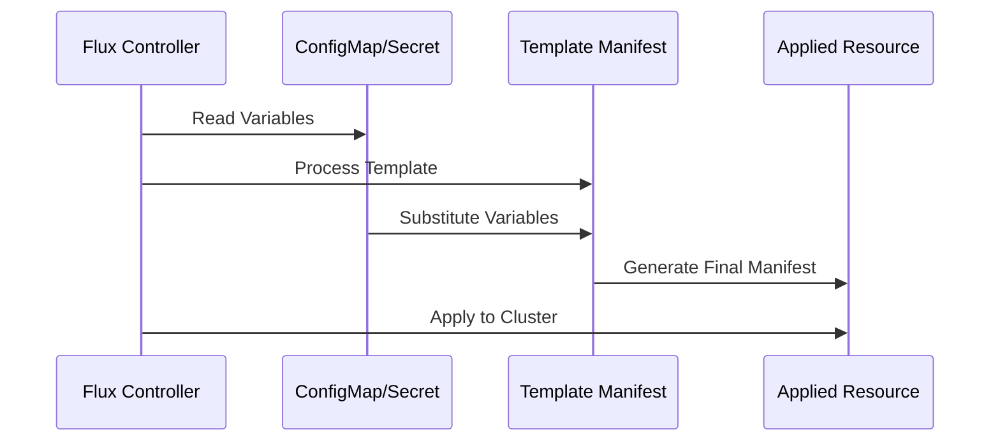
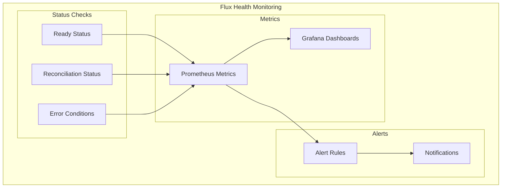

# Flux GitOps Workflow

## Table of Contents

- [Overview](#overview)
- [GitOps Architecture](#gitops-architecture)
- [Flux Configuration](#flux-configuration)
- [Repository Structure](#repository-structure)
- [Deployment Layers](#deployment-layers)
- [Secret Management](#secret-management)
- [Helm Repositories](#helm-repositories)
- [Variable Substitution](#variable-substitution)
- [Monitoring and Troubleshooting](#monitoring-and-troubleshooting)

## Overview

Flux CD provides the GitOps engine for the HomeCluster, enabling declarative, automated deployments directly from Git repositories. All cluster state is defined in code and automatically synchronized, ensuring consistency and enabling easy rollbacks.

**Key Principles**:
- **Declarative**: All desired state defined in Git
- **Automated**: Continuous reconciliation without manual intervention
- **Auditable**: Complete change history in Git
- **Secure**: SOPS-encrypted secrets and RBAC controls

## GitOps Architecture



## Flux Configuration

### Core Flux Setup
**Location**: `kubernetes/flux/config/`

The main Flux configuration defines the root Kustomization that manages the entire cluster:

```yaml
# cluster.yaml - Root Kustomization
apiVersion: kustomize.toolkit.fluxcd.io/v1
kind: Kustomization
metadata:
  name: cluster
  namespace: flux-system
spec:
  interval: 30m
  path: ./kubernetes/flux
  prune: true
  sourceRef:
    kind: GitRepository
    name: flux-system
  decryption:
    provider: sops
    secretRef:
      name: sops-age
```

### Flux Components
- **Source Controller**: Manages Git and Helm repositories
- **Kustomize Controller**: Applies Kustomize configurations
- **Helm Controller**: Manages Helm releases
- **Notification Controller**: Sends alerts and webhooks

## Repository Structure

### Flux Directory Layout
```
kubernetes/flux/
├── config/           # Flux system configuration
├── repositories/     # External repository definitions
│   ├── helm/        # Helm chart repositories
│   └── oci/         # OCI artifact repositories
├── vars/            # Cluster variables and secrets
├── apps.yaml        # Application layer
├── core.yaml        # Core services layer
├── infrastructure.yaml # Infrastructure layer
└── operators.yaml   # Operator layer
```

### Layer Dependencies


## Deployment Layers

### 1. Infrastructure Layer
**File**: `kubernetes/flux/infrastructure.yaml`
**Path**: `./kubernetes/infra`

Foundational components that must be deployed first:
- Cilium CNI
- Istio service mesh
- OpenEBS storage
- Core monitoring stack

### 2. Operators Layer
**File**: `kubernetes/flux/operators.yaml`
**Path**: `./kubernetes/operators`

Custom Resource Definitions and operators:
- CloudNative-PG (PostgreSQL)
- Strimzi (Kafka)
- ArangoDB Operator
- Rook-Ceph
- Elastic Operator

### 3. Core Services Layer
**File**: `kubernetes/flux/core.yaml`
**Path**: `./kubernetes/core`

Essential platform services:
- Authentik (Identity Provider)
- Harbor (Container Registry)
- Tekton (CI/CD Pipelines)

**Dependencies**: Infrastructure layer must be healthy

### 4. Applications Layer
**File**: `kubernetes/flux/apps.yaml`
**Path**: `./kubernetes/apps`

User-facing applications and workloads:
- Web applications
- Databases
- Development tools
- Virtual machines

**Dependencies**: Core and Infrastructure layers must be healthy

## Secret Management

### SOPS Integration


### Secret Configuration
**Location**: `.sops.yaml`

```yaml
creation_rules:
  - path_regex: kubernetes/.*\.sops\.ya?ml
    encrypted_regex: ^(data|stringData)$
    key_groups:
      - age: [age10vdnx33zyesr04jeeepdungzmzhj3572pz9ccev3zsj6dxhvz49slagxdv]
```

### Secret Types
- **Cluster Secrets**: Database passwords, API keys
- **User Secrets**: Application-specific credentials
- **TLS Certificates**: Private keys and certificates
- **OAuth Tokens**: Authentication provider secrets

## Helm Repositories

### Repository Management
**Location**: `kubernetes/flux/repositories/helm/`

Flux manages multiple Helm repositories for different components:

**Key Repositories**:
- **Istio**: Service mesh components
- **Grafana**: Monitoring and visualization
- **Authentik**: Identity and access management
- **CloudNative-PG**: PostgreSQL operator
- **Strimzi**: Apache Kafka operator

### OCI Repositories
**Location**: `kubernetes/flux/repositories/oci/`

OCI artifact repositories for modern Helm charts:
- **Bitnami**: Database and application charts
- **Prometheus Community**: Monitoring stack
- **Weave GitOps**: GitOps tooling

### Repository Configuration Example
```yaml
apiVersion: source.toolkit.fluxcd.io/v1beta2
kind: HelmRepository
metadata:
  name: istio
  namespace: flux-system
spec:
  interval: 2h
  url: https://istio-release.storage.googleapis.com/charts
```

## Variable Substitution

### Cluster Variables
**Location**: `kubernetes/flux/vars/`

Flux supports variable substitution for environment-specific configurations:

#### Cluster Settings
**File**: `cluster-settings.yaml`
- Cluster domain names
- Network configurations
- Resource limits
- Feature flags

#### Cluster Secrets
**File**: `cluster-secrets.sops.yaml` (encrypted)
- Database passwords
- API tokens
- Certificate keys
- OAuth secrets

### Variable Usage
Variables are substituted using the `${VAR_NAME}` syntax in Kubernetes manifests:

```yaml
apiVersion: v1
kind: ConfigMap
metadata:
  name: app-config
data:
  domain: "${CLUSTER_DOMAIN}"
  database_host: "${DATABASE_HOST}"
```

### Substitution Flow


## Monitoring and Troubleshooting

### Flux Status Commands
```bash
# Check overall Flux status
flux get all

# Check specific resource types
flux get sources git
flux get sources helm
flux get kustomizations
flux get helmreleases

# Check for reconciliation issues
flux get kustomizations --status-selector ready=false
flux get helmreleases --status-selector ready=false
```

### Common Troubleshooting Steps

#### 1. Source Issues
```bash
# Check Git repository status
flux get sources git flux-system
kubectl describe gitrepository flux-system -n flux-system

# Force reconciliation
flux reconcile source git flux-system
```

#### 2. Kustomization Issues
```bash
# Check kustomization status
flux get kustomizations
kubectl describe kustomization cluster-apps -n flux-system

# View detailed logs
kubectl logs -n flux-system deployment/kustomize-controller
```

#### 3. Helm Release Issues
```bash
# Check Helm releases
flux get helmreleases -A
kubectl describe helmrelease <release-name> -n <namespace>

# View Helm controller logs
kubectl logs -n flux-system deployment/helm-controller
```

#### 4. Secret Decryption Issues
```bash
# Verify SOPS configuration
kubectl get secret sops-age -n flux-system
kubectl describe secret sops-age -n flux-system

# Test decryption manually
sops -d kubernetes/flux/vars/cluster-secrets.sops.yaml
```

### Health Monitoring


### Performance Optimization

#### Reconciliation Intervals
- **Infrastructure**: 30 minutes (stable components)
- **Applications**: 15 minutes (frequent updates)
- **Secrets**: 1 hour (security-sensitive)

#### Resource Management
- **CPU/Memory Limits**: Appropriate resource allocation
- **Parallel Processing**: Multiple controller replicas
- **Caching**: Efficient artifact caching

### Disaster Recovery

#### Backup Strategy
1. **Git Repository**: Primary source of truth
2. **Cluster State**: Automated snapshots
3. **Secrets**: Encrypted backup storage
4. **Configuration**: Version-controlled templates

#### Recovery Process
1. **Restore Git Access**: Ensure repository availability
2. **Bootstrap Flux**: Reinstall Flux controllers
3. **Sync Configuration**: Force full reconciliation
4. **Verify Health**: Check all components

### Best Practices

#### Development Workflow
1. **Feature Branches**: Develop changes in branches
2. **Pull Requests**: Review before merging
3. **Staging**: Test in non-production environment
4. **Gradual Rollout**: Deploy incrementally

#### Security Considerations
- **Least Privilege**: Minimal RBAC permissions
- **Secret Rotation**: Regular credential updates
- **Audit Logging**: Track all changes
- **Network Policies**: Restrict controller access

#### Maintenance
- **Regular Updates**: Keep Flux components current
- **Monitoring**: Continuous health monitoring
- **Documentation**: Maintain deployment guides
- **Testing**: Validate changes before deployment