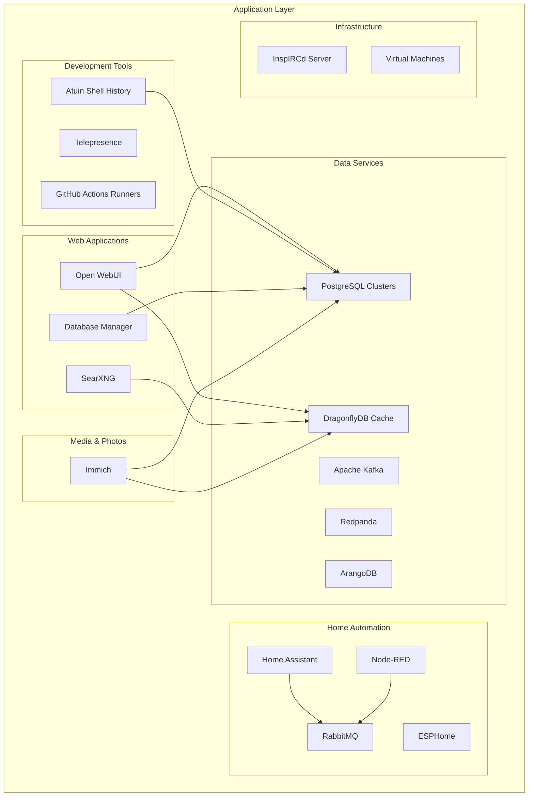
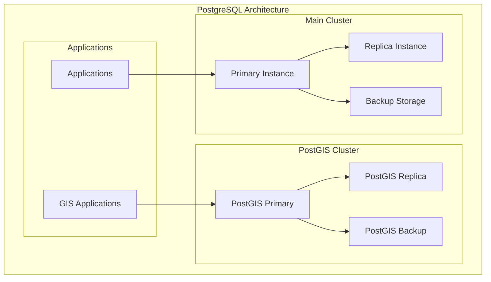
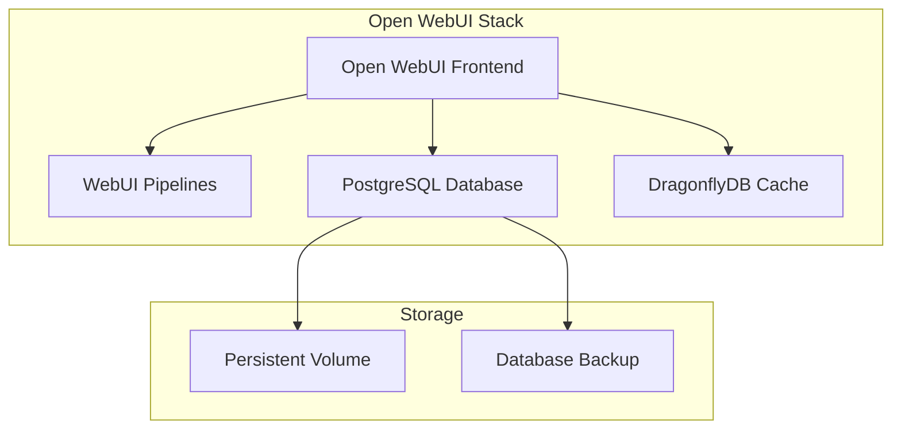
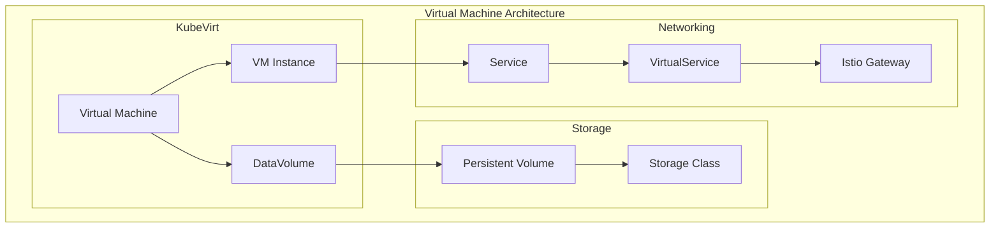
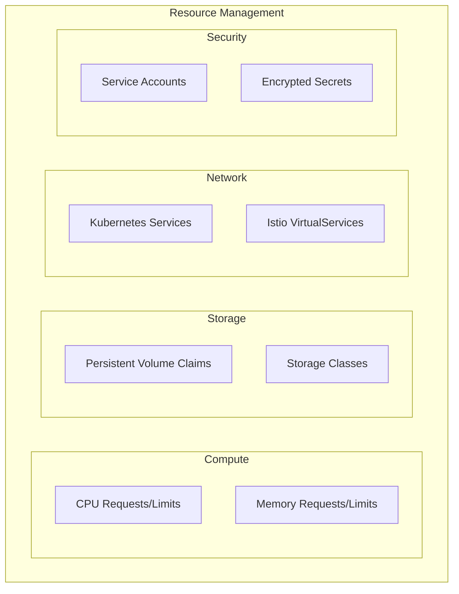

# Kubernetes Applications

## Table of Contents

- [Overview](#overview)
- [Application Architecture](#application-architecture)
- [Database Applications](#database-applications)
- [Development Tools](#development-tools)
- [Web Applications](#web-applications)
- [Infrastructure Applications](#infrastructure-applications)
- [Virtual Machines](#virtual-machines)
- [Application Management](#application-management)

## Overview

The applications layer contains user-facing services and tools deployed on the Kubernetes cluster. Applications are organized by namespace and follow GitOps principles for deployment and management.

**Application Namespaces**:
- `actions-runner-system`: GitHub Actions self-hosted runners
- `arangodb`: ArangoDB multi-model database
- `atuin`: Shell history synchronization
- `default`: General-purpose applications (Open WebUI, SearXNG, dbman)
- `home-system`: Home automation and IoT services (Home Assistant, ESPHome, Node-RED)
- `immich`: Photo and video management
- `irc`: Internet Relay Chat services
- `kafka`: Event streaming platform
- `postgres`: PostgreSQL database clusters
- `redpanda`: Kafka-compatible streaming platform
- `telepresence`: Development tools
- `vms`: Virtual machine workloads

## Application Architecture



## Database Applications

### PostgreSQL Clusters
**Location**: `kubernetes/apps/postgres/`

Multiple PostgreSQL clusters providing database services for applications.

#### Main Cluster
**Path**: `kubernetes/apps/postgres/cluster/`

Primary PostgreSQL cluster with:
- **High Availability**: Multi-replica setup
- **Automated Backups**: Scheduled backups to external storage
- **User Management**: Multiple database users with specific permissions
- **Monitoring**: Prometheus metrics integration

**Databases**:
- `hunter`: Application database
- `spanner`: Additional application database

#### PostGIS Cluster
**Path**: `kubernetes/apps/postgres/postgis/`

Specialized PostgreSQL cluster with PostGIS extension for geospatial data:
- **PostGIS Extension**: Geographic information system capabilities
- **Spatial Indexing**: Optimized for location-based queries
- **Backup Strategy**: Automated backups with spatial data preservation



### Apache Kafka
**Location**: `kubernetes/apps/kafka/snail-cluster/`

Event streaming platform for real-time data processing:

**Features**:
- **Distributed Architecture**: Multi-broker cluster
- **Load Balancer**: External access via LoadBalancer service
- **Metrics Integration**: Prometheus monitoring
- **Node Pools**: Dedicated node placement

**Configuration**:
- **Brokers**: Multiple Kafka brokers for high availability
- **Topics**: Event streaming topics for different data types
- **Consumers**: Application consumers for event processing

## Development Tools

### Atuin Shell History
**Location**: `kubernetes/apps/atuin/`

Synchronizes shell history across multiple machines with encryption and search capabilities.

**Components**:
- **Atuin Server**: Central history synchronization service
- **PostgreSQL Database**: Encrypted history storage
- **Web Interface**: History browsing and search
- **API Service**: Client synchronization endpoint

**Features**:
- End-to-end encryption
- Cross-platform synchronization
- Advanced search capabilities
- Privacy-focused design

### Telepresence
**Location**: `kubernetes/apps/telepresence/`

Development tool for local development against remote Kubernetes clusters.

**Capabilities**:
- **Local Development**: Run services locally while connected to cluster
- **Traffic Interception**: Route specific traffic to local services
- **Debugging**: Debug applications in cluster context
- **Fast Iteration**: Rapid development cycles

## Web Applications

### Open WebUI
**Location**: `kubernetes/apps/default/open-webui/`

Modern web interface for AI language models and chat applications.

**Architecture**:


**Features**:
- **AI Chat Interface**: Modern chat UI for language models
- **Pipeline Processing**: Background task processing
- **Database Integration**: PostgreSQL for data persistence
- **Caching Layer**: DragonflyDB for performance optimization
- **Persistent Storage**: Volume mounts for file storage

### SearXNG
**Location**: `kubernetes/apps/default/searxng/`

Privacy-focused metasearch engine aggregating results from multiple search engines.

**Components**:
- **SearXNG Engine**: Core search aggregation service
- **DragonflyDB Cache**: Search result caching
- **Configuration**: Custom search engine settings
- **Rate Limiting**: Request throttling configuration

**Features**:
- Privacy protection
- Multiple search engine aggregation
- Custom result filtering
- No tracking or logging

### Database Manager
**Location**: `kubernetes/apps/default/dbman/`

Web-based database administration tool for managing PostgreSQL clusters.

**Capabilities**:
- Database browsing and querying
- Schema management
- User administration
- Performance monitoring

## Infrastructure Applications

### Immich
**Location**: `kubernetes/apps/immich/immich/`

Self-hosted photo and video management platform with AI-powered search and organization.

**Components**:
- **Immich Server**: Core application with web interface and API
- **PostgreSQL Database**: Metadata and user data storage (via CloudNative-PG)
- **DragonflyDB Cache**: Redis-compatible caching layer
- **Machine Learning**: AI-powered face recognition and object detection

**Features**:
- Mobile app backup and sync
- AI-powered search and tagging
- Face recognition and clustering
- Timeline and map views
- Sharing and album management

### Home Automation

#### Home Assistant
**Location**: `kubernetes/apps/home-system/home-assistant/`

Open-source home automation platform for smart home control and automation.

**Features**:
- Device integration and control
- Automation rules and scenes
- Energy monitoring
- Voice assistant integration

#### ESPHome
**Location**: `kubernetes/apps/home-system/esphome/`

Configuration and management platform for ESP8266/ESP32 IoT devices.

**Features**:
- YAML-based device configuration
- OTA firmware updates
- Native Home Assistant integration
- Sensor and actuator management

#### Node-RED
**Location**: `kubernetes/apps/home-system/node-red/`

Flow-based automation tool for wiring together hardware devices, APIs, and services.

**Features**:
- Visual flow editor
- Extensive node library
- Home Assistant integration
- MQTT and HTTP support

#### RabbitMQ
**Location**: `kubernetes/apps/home-system/home-system-rabbitmq/`

Message broker for home automation event routing between services.

### InspIRCd Server
**Location**: `kubernetes/apps/irc/inspircd/`

Internet Relay Chat server for real-time communication.

**Configuration**:
- **IRC Server**: InspIRCd daemon
- **Persistent Storage**: Chat logs and configuration
- **Network Service**: IRC protocol support
- **Custom Configuration**: Server-specific settings

### Virtual Machines
**Location**: `kubernetes/apps/vms/`

KubeVirt-based virtual machine workloads running on Kubernetes.

#### Arch Linux VM
**Path**: `kubernetes/apps/vms/arch-linux/`

Virtual machine running Arch Linux for development and testing:

**Components**:
- **DataVolume**: VM disk image storage
- **VirtualMachine**: VM definition and configuration
- **Service**: Network access to VM
- **VirtualService**: Istio routing for VM access

**Features**:
- Full Linux environment
- Persistent storage
- Network connectivity
- Remote access capabilities



## Application Management

### Deployment Strategy
All applications follow GitOps principles:

1. **Configuration as Code**: All configurations stored in Git
2. **Flux Synchronization**: Automated deployment via Flux
3. **Secret Management**: SOPS-encrypted secrets
4. **Health Monitoring**: Readiness and liveness probes

### Resource Management


### Scaling and Performance
- **Horizontal Pod Autoscaling**: Automatic scaling based on metrics
- **Resource Optimization**: Right-sized resource requests
- **Caching Strategies**: DragonflyDB for application caching
- **Database Optimization**: Connection pooling and query optimization

### Backup and Recovery
- **Database Backups**: Automated PostgreSQL backups
- **Configuration Backup**: Git repository versioning
- **Volume Snapshots**: Storage-level backups
- **Disaster Recovery**: Multi-replica deployments

### Monitoring and Observability
- **Prometheus Metrics**: Application performance monitoring
- **Grafana Dashboards**: Visual monitoring and alerting
- **Distributed Tracing**: Request flow tracking
- **Log Aggregation**: Centralized logging with Loki

### Security Considerations
- **Network Policies**: Traffic segmentation
- **Service Mesh Security**: mTLS encryption
- **Secret Encryption**: SOPS/Age encryption
- **RBAC**: Least privilege access control

## Troubleshooting

### Common Issues
1. **Application Startup**: Check pod logs and events
2. **Database Connectivity**: Verify service endpoints
3. **Storage Issues**: Check PVC status and storage class
4. **Network Problems**: Validate service mesh configuration

### Diagnostic Commands
```bash
# Check application status
kubectl get pods -n <namespace>
kubectl describe pod <pod-name> -n <namespace>
kubectl logs <pod-name> -n <namespace>

# Verify services and networking
kubectl get svc -n <namespace>
kubectl get virtualservice -n <namespace>
istioctl proxy-config cluster <pod-name>

# Check storage
kubectl get pvc -n <namespace>
kubectl describe pvc <pvc-name> -n <namespace>

# Monitor resources
kubectl top pods -n <namespace>
kubectl get events -n <namespace> --sort-by='.metadata.creationTimestamp'
```

### Performance Optimization
- **Resource Tuning**: Adjust CPU/memory requests and limits
- **Database Optimization**: Query performance and indexing
- **Caching**: Implement application-level caching
- **Connection Pooling**: Optimize database connections
