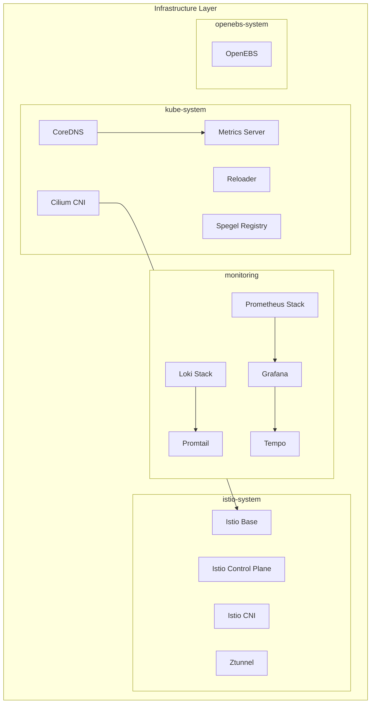
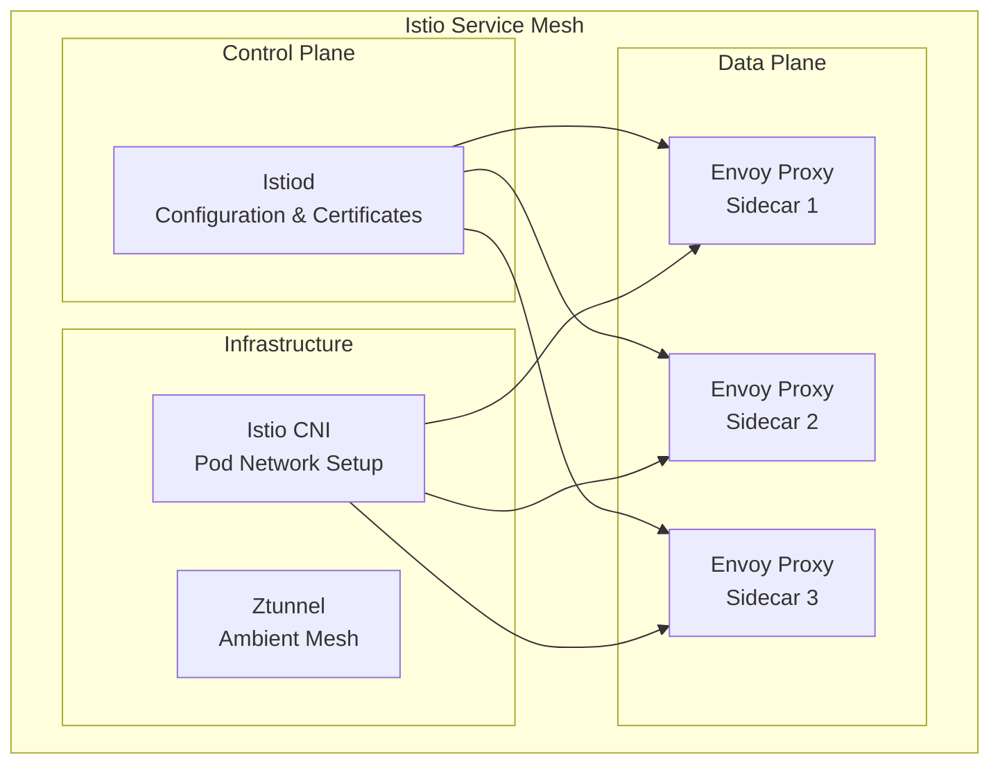
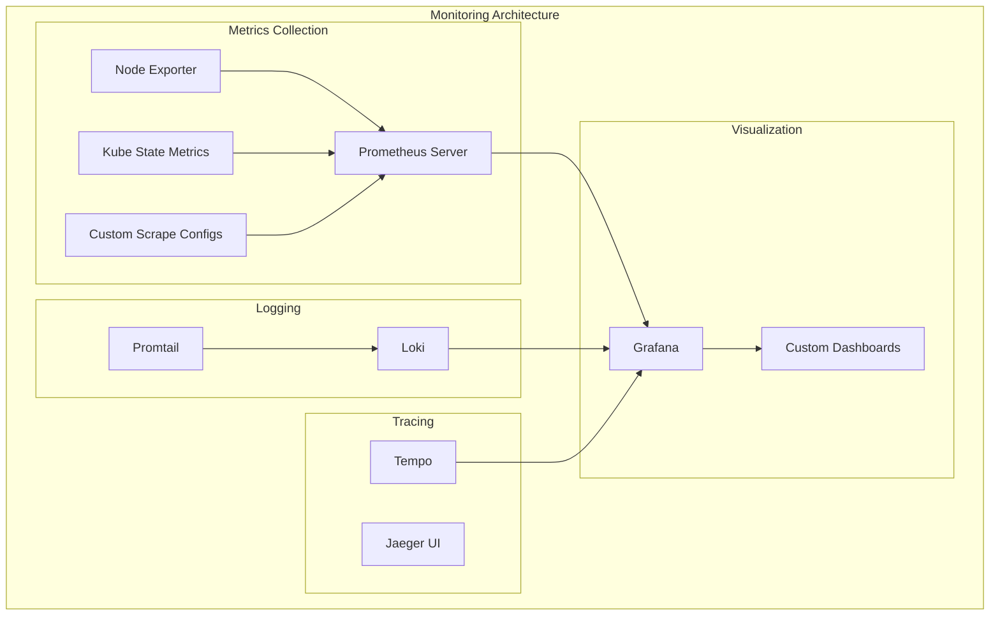
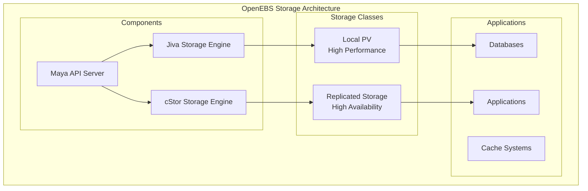
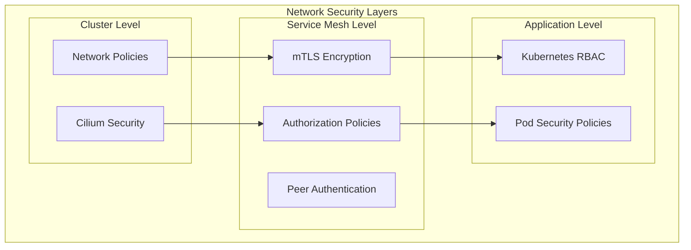

# Kubernetes Infrastructure

## Table of Contents

- [Overview](#overview)
- [Infrastructure Components](#infrastructure-components)
- [Core System Services](#core-system-services)
- [Service Mesh](#service-mesh)
- [Monitoring Stack](#monitoring-stack)
- [Storage](#storage)
- [Networking](#networking)
- [Security](#security)

## Overview

The Kubernetes infrastructure layer provides the foundational services and components that enable the platform to operate reliably. This includes networking, storage, monitoring, service mesh, and core system services.

The infrastructure is organized into several key namespaces:
- `kube-system`: Core Kubernetes services
- `istio-system`: Service mesh components
- `monitoring`: Observability stack
- `openebs-system`: Storage infrastructure

## Infrastructure Components



## Core System Services

### Cilium CNI
**Location**: `kubernetes/infra/kube-system/cilium/`

Cilium provides advanced networking and security capabilities using eBPF technology.

**Key Features**:
- eBPF-based networking
- Network policies and security
- Load balancing
- Service mesh integration
- L2 announcements for LoadBalancer services

**Configuration**:
```yaml
# Key Cilium features enabled
features:
  - hubble (network observability)
  - l2announcements (LoadBalancer support)
  - gatewayAPI (Gateway API support)
  - envoyConfig (Envoy proxy configuration)
```

### CoreDNS
**Location**: `kubernetes/infra/kube-system/coredns/`

Provides DNS resolution within the cluster with custom configurations for home lab environments.

### Metrics Server
**Location**: `kubernetes/infra/kube-system/metrics-server/`

Collects resource metrics from kubelets for horizontal pod autoscaling and resource monitoring.

### Reloader
**Location**: `kubernetes/infra/kube-system/reloader/`

Automatically restarts pods when ConfigMaps or Secrets are updated, ensuring applications pick up configuration changes.

### Spegel
**Location**: `kubernetes/infra/kube-system/spegel/`

Distributed container image registry that caches images across cluster nodes for improved performance and reduced external bandwidth usage.

## Service Mesh

### Istio Architecture


### Istio Base
**Location**: `kubernetes/infra/istio-system/base/`

Provides the foundational CRDs and base configuration for Istio.

### Istio Control Plane (Istiod)
**Location**: `kubernetes/infra/istio-system/istiod/`

The unified control plane that handles:
- Service discovery
- Configuration distribution
- Certificate management
- Policy enforcement

**Security Configuration**:
- Peer authentication policies
- Authorization policies
- mTLS enforcement

### Istio CNI
**Location**: `kubernetes/infra/istio-system/cni/`

Replaces the init container approach for setting up pod networking, providing better security and performance.

### Ztunnel (Ambient Mesh)
**Location**: `kubernetes/infra/istio-system/ztunnel/`

Enables ambient mesh capabilities for applications that don't require sidecar proxies.

## Monitoring Stack

### Prometheus Stack Architecture


### Kube-Prometheus-Stack
**Location**: `kubernetes/infra/monitoring/kube-prometheus-stack/`

Comprehensive monitoring solution including:
- Prometheus server
- Alertmanager
- Grafana
- Various exporters
- Pre-configured dashboards and alerts

**Key Features**:
- Istio integration for service mesh metrics
- Custom scrape configurations
- Virtual services for external access
- Alert rules for cluster health

### Grafana
**Location**: `kubernetes/infra/monitoring/grafana/`

Visualization platform with:
- OAuth integration via Authentik
- Custom dashboards
- Multi-datasource support (Prometheus, Loki, Tempo)
- Webhook notifications

### Loki Stack
**Location**: `kubernetes/infra/monitoring/loki-stack/`

Log aggregation system that:
- Collects logs from all cluster components
- Integrates with Grafana for log visualization
- Provides efficient log storage and querying

### Tempo
**Location**: `kubernetes/infra/monitoring/tempo/`

Distributed tracing backend that:
- Collects traces from Istio and applications
- Integrates with Grafana for trace visualization
- Uses DragonflyDB for caching

### Promtail
**Location**: `kubernetes/infra/monitoring/promtail/`

Log collection agent that ships logs to Loki from all cluster nodes.

## Storage

### OpenEBS
**Location**: `kubernetes/infra/openebs-system/openebs/`

Container-attached storage solution providing:

**Storage Classes**:
- **Local PV**: High-performance local storage
- **Replicated Storage**: Data replication across nodes
- **Dynamic Provisioning**: Automatic volume creation

**Features**:
- Snapshot support
- Volume expansion
- Data protection and backup
- Integration with Kubernetes CSI



## Networking

### Network Policies
Cilium provides advanced network security through:
- **Pod-to-pod communication** control
- **Ingress/egress** traffic filtering
- **Service-to-service** security policies
- **External service** access control

### Load Balancing
- **Cilium L2 Announcements**: LoadBalancer service support
- **Istio Load Balancing**: Advanced traffic distribution
- **Service Mesh**: Intelligent routing and failover

### DNS Configuration
- **CoreDNS**: Internal cluster DNS resolution
- **External-DNS**: Automatic external DNS record management
- **Split DNS**: Separate internal and external resolution

## Security

### Network Security


### Certificate Management
- **Istio CA**: Internal certificate authority
- **Cert-Manager**: External certificate management
- **Automatic Rotation**: Certificate lifecycle management

### Access Control
- **RBAC**: Role-based access control
- **Service Accounts**: Pod identity management
- **Network Policies**: Traffic segmentation

## Maintenance and Operations

### Automated Updates
- **Renovate**: Dependency updates
- **Flux**: GitOps-driven deployments
- **Health Checks**: Automated monitoring

### Backup and Recovery
- **Volume Snapshots**: Storage backup
- **Configuration Backup**: GitOps repository
- **Disaster Recovery**: Multi-node redundancy

### Scaling Considerations
- **Horizontal Pod Autoscaling**: Automatic pod scaling
- **Vertical Pod Autoscaling**: Resource optimization
- **Cluster Autoscaling**: Node management

## Troubleshooting

### Common Issues
1. **Network Connectivity**: Check Cilium and Istio status
2. **Storage Issues**: Verify OpenEBS components
3. **Monitoring Gaps**: Validate Prometheus targets
4. **Certificate Problems**: Check cert-manager logs

### Diagnostic Commands
```bash
# Check infrastructure health
kubectl get pods -n kube-system
kubectl get pods -n istio-system
kubectl get pods -n monitoring
kubectl get pods -n openebs-system

# Verify network connectivity
cilium status
cilium connectivity test

# Check service mesh
istioctl proxy-status
istioctl analyze

# Monitor resource usage
kubectl top nodes
kubectl top pods --all-namespaces
```