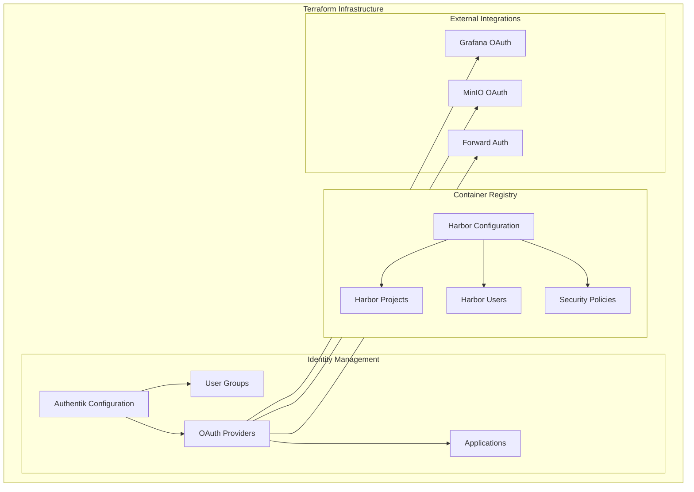
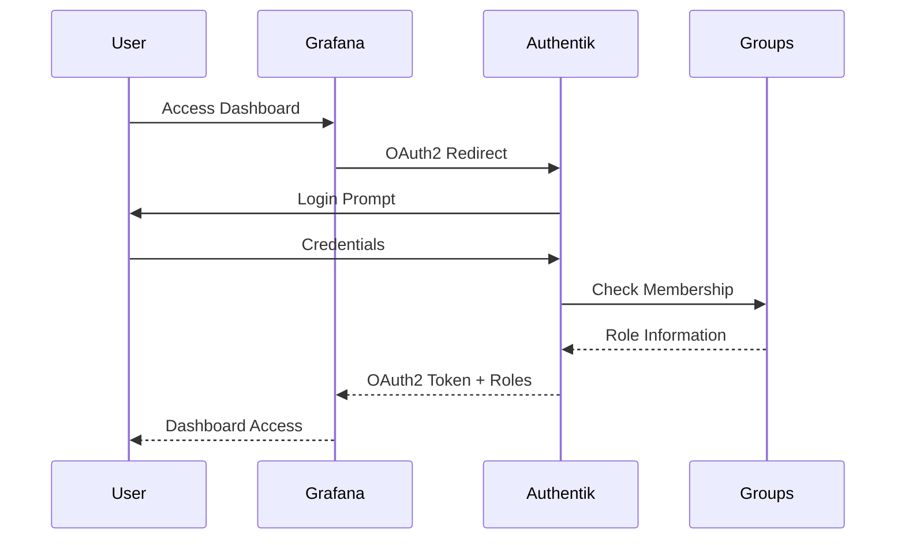
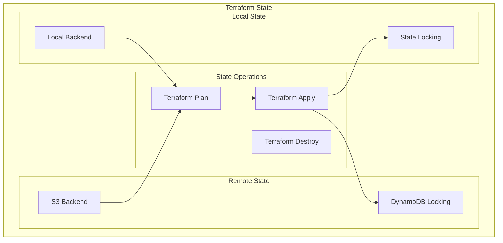
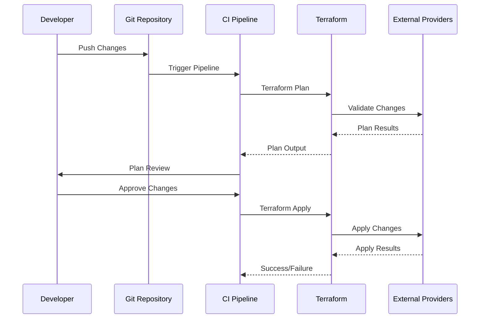

# Terraform Infrastructure Provisioning

## Table of Contents

- [Overview](#overview)
- [Terraform Architecture](#terraform-architecture)
- [Authentik Configuration](#authentik-configuration)
- [Harbor Configuration](#harbor-configuration)
- [Provider Configuration](#provider-configuration)
- [Resource Management](#resource-management)
- [Security Considerations](#security-considerations)
- [Deployment Workflow](#deployment-workflow)

## Overview

This repository uses **OpenTofu** (a Terraform‑compatible tool) to provision and manage external infrastructure components that integrate with the Kubernetes cluster. The primary focus is on configuring identity providers, container registries, and other external services that support the cluster ecosystem.

**Key Components**:
- **Authentik**: Identity and access management configuration
- **Harbor**: Container registry setup and integration
- **Provider Configurations**: External service integrations

## Terraform Architecture



## Authentik Configuration

### Directory Structure
```
provision/terraform/authentik/
├── main.tf           # Core Authentik resources
├── grafana.tf        # Grafana OAuth integration
├── harbor.tf         # Harbor integration
├── minio.tf          # MinIO OAuth setup
├── provider.tf       # Terraform providers
└── vars.tf           # Variable definitions
```

### Core Resources

#### User Groups
**File**: `main.tf`

Authentik groups provide role-based access control across applications:

```hcl
resource "authentik_group" "open_webui_users" {
  name         = "Open WebUI Users"
  is_superuser = false
}

resource "authentik_group" "grafana_admins" {
  name = "Grafana Admins"
}
```

**Defined Groups**:
- **Open WebUI Users**: Access to AI chat interface
- **Argo CD Users**: CI/CD pipeline access
- **Grafana Admins/Editors/Viewers**: Monitoring dashboard roles
- **Application-specific groups**: Custom access controls

#### Forward Authentication Provider
**File**: `main.tf`

Istio forward authentication integration:

```hcl
resource "authentik_provider_proxy" "istio_forward_auth" {
  name               = "Istio Forward Auth"
  external_host      = "https://auth.${var.cluster_domain}"
  mode               = "forward_single"
  authorization_flow = data.authentik_flow.default-authorization-flow.id
  
  skip_path_regex = "^/(healthz|metrics|\\.well-known/.*|outpost\\.goauthentik\\.io/.*)$"
}
```

**Features**:
- Single sign-on for Istio services
- Health check path exclusions
- Automatic user session management
- Integration with Kubernetes RBAC

### OAuth2 Integrations

#### Grafana Integration
**File**: `grafana.tf`

OAuth2 provider for Grafana authentication:



**Configuration**:
- **Client Credentials**: Secure OAuth2 client setup
- **Redirect URLs**: Grafana callback endpoints
- **Scope Mappings**: User profile and group information
- **Role Mapping**: Authentik groups to Grafana roles

#### MinIO Integration
**File**: `minio.tf`

Object storage authentication integration:

```hcl
resource "authentik_provider_oauth2" "minio" {
  name               = "MinIO"
  client_id          = var.minio_client.client_id
  client_secret      = var.minio_client.client_secret
  authorization_flow = data.authentik_flow.default-authorization-flow.id
  
  allowed_redirect_uris = var.minio_client.redirect_urls
}
```

### Outpost Configuration

Authentik outposts provide authentication services within the Kubernetes cluster:

```hcl
resource "authentik_outpost" "istio_forward_auth" {
  name               = "istio-forward-auth"
  type               = "proxy"
  protocol_providers = [authentik_provider_proxy.istio_forward_auth.id]
  
  config = jsonencode({
    authentik_host          = "https://auth.${var.cluster_domain}"
    kubernetes_namespace    = "authentik"
    kubernetes_service_type = "ClusterIP"
    kubernetes_replicas     = 1
  })
}
```

## Harbor Configuration

### Directory Structure
```
provision/terraform/harbor/
└── providers.tf      # Harbor provider configuration
```

### Harbor Integration
Harbor serves as the enterprise container registry with:

**Features**:
- **Image Scanning**: Vulnerability assessment
- **Access Control**: Role-based permissions
- **Replication**: Multi-registry synchronization
- **Webhook Integration**: CI/CD pipeline triggers

**Integration Points**:
- **Authentik SSO**: Single sign-on authentication
- **Kubernetes**: Image pull secrets
- **CI/CD Pipelines**: Automated image builds
- **Security Scanning**: Automated vulnerability checks

## Provider Configuration

### Authentik Provider
**File**: `authentik/provider.tf`

```hcl
terraform {
  required_providers {
    authentik = {
      source  = "goauthentik/authentik"
      version = "~> 2024.2.0"
    }
  }
}

provider "authentik" {
  url   = var.authentik_url
  token = var.authentik_token
}
```

### Harbor Provider
**File**: `harbor/providers.tf`

```hcl
terraform {
  required_providers {
    harbor = {
      source  = "goharbor/harbor"
      version = "~> 3.10.0"
    }
  }
}

provider "harbor" {
  url      = var.harbor_url
  username = var.harbor_username
  password = var.harbor_password
}
```

## Resource Management

### State Management


### Variable Management

#### Sensitive Variables
Variables containing sensitive information are managed securely:

```hcl
variable "authentik_token" {
  description = "Authentik API token"
  type        = string
  sensitive   = true
}

variable "grafana_client" {
  description = "Grafana OAuth client configuration"
  type = object({
    client_id     = string
    client_secret = string
    redirect_urls = list(string)
    icon          = string
    launch_url    = string
  })
  sensitive = true
}
```

## Security Considerations

### Secret Management
- **Terraform Variables**: Sensitive data marked as sensitive
- **Environment Variables**: Runtime secret injection
- **State File Security**: Encrypted state storage
- **Access Control**: Limited Terraform execution permissions

### Network Security
- **Provider Authentication**: Secure API token management
- **TLS Encryption**: All provider communications encrypted
- **Network Policies**: Restricted access to management interfaces
- **Audit Logging**: Complete change tracking

## Deployment Workflow

### Common Commands
```bash
# Initialize the OpenTofu working directory
tofu init

# Show a plan of changes
tofu plan -var-file=../bootstrap/vars/config.yaml

# Apply the changes
tofu apply -auto-approve

# Validate configuration
tofu validate

# View current state
tofu show

# Destroy resources (use with caution)
tofu destroy
```

### Integration with Flux
After provisioning, the generated Kubernetes manifests are rendered by the `task configure` command and applied to the cluster via Flux.

### CI/CD Integration


### Best Practices

#### Code Organization
- **Module Structure**: Logical resource grouping
- **Variable Management**: Consistent naming conventions
- **Documentation**: Comprehensive resource documentation
- **Version Control**: Semantic versioning for modules

#### Security Best Practices
- **Least Privilege**: Minimal required permissions
- **Secret Rotation**: Regular credential updates
- **Audit Trails**: Complete change logging
- **Encryption**: Data encryption at rest and in transit
